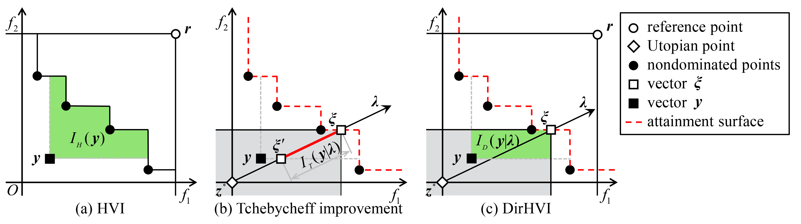

# DirHV-EGO

**The Python implementation of DirHV-EGO is available at [LibMOON](https://github.com/xzhang2523/libmoon). This repository contains the official Matlab code.** 

> **Liang Zhao and Qingfu Zhang. Hypervolume-Guided Decomposition for Parallel Expensive Multiobjective Optimization. IEEE Transactions on Evolutionary Computation,  28(2): 432-444, 2024. [[PDF](https://ieeexplore.ieee.org/document/10093980)] [[Supplementary](https://ieeexplore.ieee.org/document/10093980/media#media)]** <br/>



**Direction-based Hypervolume Improvement (DirHVI)**

* It is designed under the MOEA/D framework to support parallel expensive multiobjective optimization.
* It only measures the hypervolume improvement within each axis-parallel box induced by the modified Tchebycheff scalarization.
* It can be regarded as an unbiased estimation of a weighted hypervolume improvement.

**Expected Direction-based Hypervolume Improvement (DirHV-EI)**

* It is defined as the expectation of DirHVI over the Gaussian process (GP) posterior $p(\boldsymbol{y}|\boldsymbol{x},\mathcal{D})$.
* It has a simple closed-form expression and is very cheap to compute.

## Usage 

Matlab >= 2018a

### Quick Start

* The `run_DirHV_EGO.m` provides the basic script to run experiments on ZDT and DTLZ.

### Advanced usage

* Download [PlatEMO](https://github.com/BIMK/PlatEMO) (version 4.6, Matlab >= 2018a) and read PlatEMO's [User Manual](https://github.com/BIMK/PlatEMO/blob/master/PlatEMO/manual.pdf) to familiarize yourself with how to use this platform.
* Copy the folders within "**./DirHV-EGO/Algorithms**" into the directory at **"PlatEMO/Algorithms/"**. Next, add all of the subfolders contained within the "PlatEMO" directory to the MATLAB search path.
* In the MATLAB command window, type **`platemo()`** to run PlatEMO using the GUI.
* Select the label "**expensive**" and choose the algorithm **"DirHV-EGO"**.
  * Default setting of `batch size`: 5.
  * Default setting of `number of initial samples`: $11d-1$.
* Select a problem and set appropriate parameters.
  * e.g., ZDT1, N=200, M=2, D=8, maxFE=200.
  * e.g., Inverted DTLZ2,  N=210, M=3, D=6, maxFE=300.


If you have any questions or feedback, please feel free to contact  liazhao5-c@my.cityu.edu.hk and qingfu.zhang@cityu.edu.hk.


## Citation
If you find our work is helpful to your research, please cite our paper:
```
@article{zhao2024hypervolume,
  author={Zhao, Liang and Zhang, Qingfu},
  journal={IEEE Transactions on Evolutionary Computation}, 
  title={Hypervolume-Guided Decomposition for Parallel Expensive Multiobjective Optimization}, 
  year={2024},
  volume={28},
  number={2},
  pages={432-444},
  doi={10.1109/TEVC.2023.3265347}
  }
```

## Acknowledgements
* This implementation is based on [PlatEMO](https://github.com/BIMK/PlatEMO).
* For GP modeling, we leverage the [DACE toolbox](https://www.omicron.dk/dace.html).
