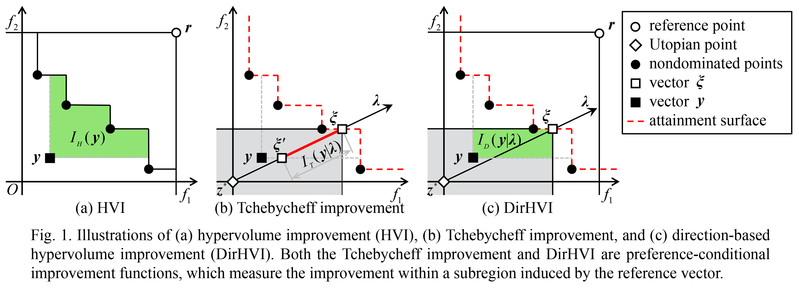

# DirHV-EGO

Official Code for the following article: 

> **Liang Zhao and Qingfu Zhang. Hypervolume-Guided Decomposition for Parallel Expensive Multiobjective Optimization. IEEE Transactions on Evolutionary Computation, 2023. [[PDF](https://ieeexplore.ieee.org/document/10093980)] [[Supplementary](https://ieeexplore.ieee.org/ielx7/4235/4358751/10093980/supp1-3265347.pdf?arnumber=10093980)]** <br/>



**Direction-based Hypervolume Improvement (DirHVI)**

* It is designed under the MOEA/D framework to support parallel expensive multiobjective optimization.
* It only measures the hypervolume improvement within each axis-parallel box induced by the modified Tchebycheff scalarization.
* It can be regarded as an unbiased estimation of a weighted hypervolume improvement.

**Expected Direction-based Hypervolume Improvement (DirHV-EI)**

* It is defined as the expectation of DirHVI over the Gaussian process (GP) posterior $p(\boldsymbol{y}|\boldsymbol{x},\mathcal{D})$.
* It has a simple closed-form expression and is very cheap to compute.

**Main Steps at Each Iteration of DirHV-EGO:**

* Objective space normalization
* Modeling (build GP models for each objective)
* Maximization of DirHV-EI 
  > Use MOEA/D to maximize the DirHV-EI values with respect to $N$ direction vectors in a collaborative manner, and $N$ candidate solutions can be obtained.
* Subset selection (select $q$ query points from the candidate solutions)
* Parallel evaluation of true objective vectors

  > Evaluate the true objective vectors at $q$ query points on multiple parallel computing resources (e.g., on $q$ machines).

## Quick Start

* Download [PlatEMO](https://github.com/BIMK/PlatEMO) (version 4.2, Matlab 2020b) and read Chapter III of PlatEMO's [User Manual](https://github.com/BIMK/PlatEMO/blob/master/PlatEMO/manual.pdf) to familiarize yourself with how to use this platform.
* Copy the folders named "**DirHV-EGO**" and "**dace-does**" into the directory at **"PlatEMO/Algorithms/"**. Next, add all of the subfolders contained within the "PlatEMO" directory to the MATLAB search path.
* In the MATLAB command window, type **`platemo()`** to run PlatEMO using the GUI.
* Select the label "**expensive**" and choose the algorithm **"DirHV-EGO"**.
  * Default setting of `batch size q`: 5.
* Select a problem and set appropriate parameters.
  * e.g., ZDT1, N=200, M=2, D=8, maxFE=200.
  * e.g., Inverted DTLZ2,  N=210, M=3, D=6, maxFE=300.


If you have any questions or feedback, please feel free to contact  liazhao5-c@my.cityu.edu.hk and qingfu.zhang@cityu.edu.hk.


## Reference
If you find our work is helpful to your research, please cite our paper:
```
@article{dirhv2023,
  author={Zhao, Liang and Zhang, Qingfu},
  journal={IEEE Transactions on Evolutionary Computation}, 
  title={Hypervolume-Guided Decomposition for Parallel Expensive Multiobjective Optimization}, 
  year={2023},
  volume={},
  number={},
  pages={1-1},
  doi={10.1109/TEVC.2023.3265347}
  }
```

## Acknowledgements
* This implementation is based on [PlatEMO](https://github.com/BIMK/PlatEMO).
* For GP modeling, we leverage the [DACE toolbox](https://www.omicron.dk/dace.html).
* For the Design of Experiment methods, we utilize existing implementations from the [SURROGATES Toolbox](https://sites.google.com/site/felipeacviana/surrogates-toolbox).
